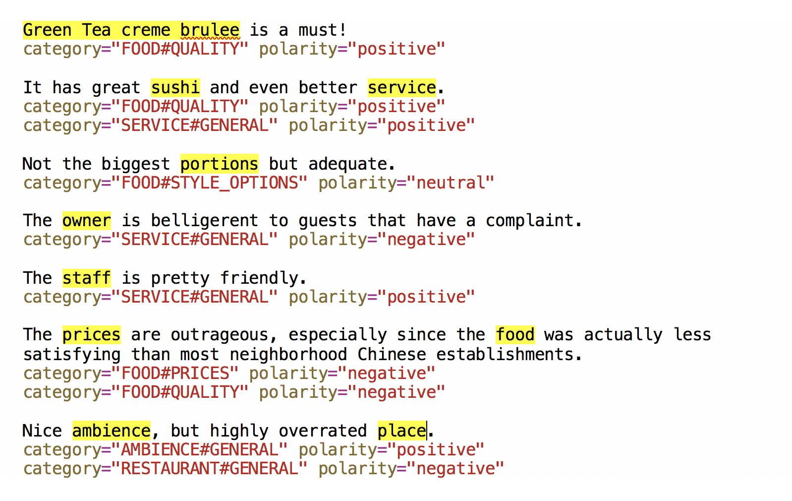
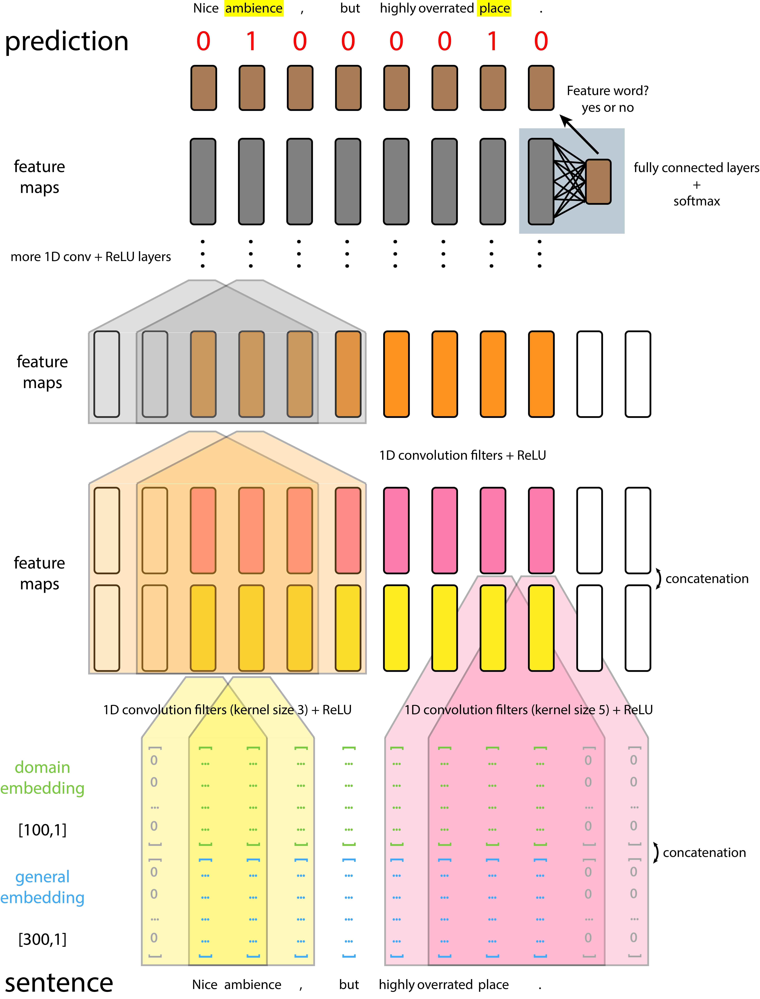
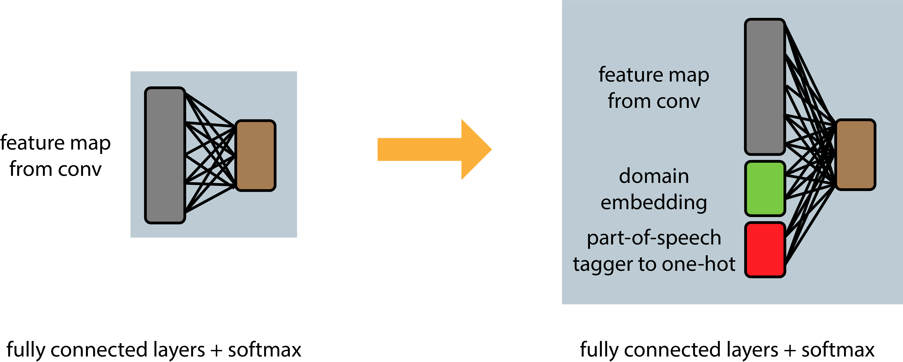
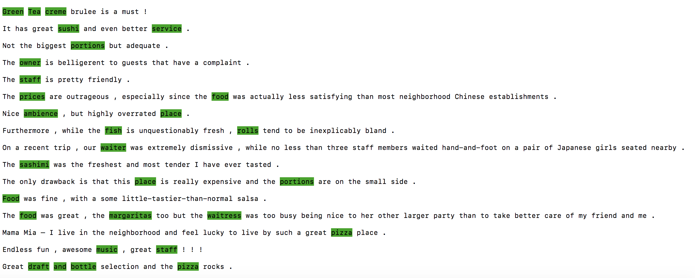

# Triple Embeddings and CNN-based Sequence Labeling for Aspect Extraction and Sentiment Analysis

## Introduction

Here is an example of aspect based sentiment analysis.
One import task of fine-grained sentiment analysis of reviews is to extract aspects or features that users have expressed opinions on.

This model utilizes two types of pre-trained embeddings and part-of-speech tagger + CNN model for aspect extraction.

For now it works pretty well on restaurant reviews, but you can train your own domain embeddings and aspect extraction models on other product reviews, too!

## Models
This code is based on this paper "Double Embeddings and CNN-based Sequence Labeling for Aspect Extraction" by Xu, H., Liu, B., Shu, L., & Yu, P. S. (2018). 

Its original code can be found in [GitHub/howardhsu/](https://github.com/howardhsu/Double-Embeddings-and-CNN-based-Sequence-Labeling-for-Aspect-Extraction) and the illustration of the model is shown above.

The two embeddings are:
1. General-purpose GloVe embeddings 
2. Domain-specific embeddings (can be created using gensim-word2vec)

In my "triple embeddings" model, feature map output from the conv layer is concatenated with domain embeddings of the word as well as its part-of-speech tagger (stanford), and then it is feeded to a fully-connected neural network with one hidden layer of size 50.

## How to use the code

Required Python modules: numpy, PyTorch (with or without CUDA), Keras, nltk, etc.

You can skip step 5/6/7 if you wish to use pre-trained model to evaluate review text files. 

#### Step 1: 
Download general embeddings (GloVe: http://nlp.stanford.edu/data/glove.840B.300d.zip ). Rename it as "gen.vec" and save it in folder: data/embedding/

#### Step 2: 
Download restaurant domain embeddings (You can find the link under this paper's title in https://www.cs.uic.edu/~hxu/ ), save them in folder: data/embedding/

The list of files in this folder are:
- gen.vec
- restaurant_emb.vec
- restaurant_emb.vec.bin

If you wish to create your own domain embeddings, you can do that with [gensim-word2vec](https://radimrehurek.com/gensim/models/word2vec.html). A demo code can be found in my repo: [GitHub - yafangy/word2vec_yelp_review_embedding](https://github.com/yafangy/word2vec_yelp_review_embedding)

#### Step 3:
Download and install fastText (https://github.com/facebookresearch/fastText).

Building fastText for Python:
~~~
$ git clone https://github.com/facebookresearch/fastText.git
$ cd fastText
$ pip install .
~~~

Now you should be able to `import fastText` in Python codes.

This is for embedding out-of-vocabulary words (words not in domain-specific embeddings).

### Step 4:
Download Stanford Log-linear Part-Of-Speech Tagger from [The Stanford Natural Language Processing Group](https://nlp.stanford.edu/software/tagger.shtml) to folder and rename it as: stanford-postagger-full/

### Step 5:
You can skip this step. The dataset is included.

Download official datasets to folder: data/official_data/

The data is from SemEval 2016 Restaurant (http://alt.qcri.org/semeval2016/task5/).

I assume the name is as follows:
- ABSA16_Restaurants_Train_SB1_v2.xml (for training)
- EN_REST_SB1_TEST_A.xml (for test)
- EN_REST_SB1_TEST_gold.xml (given best test result)

### Step 6:
The original dataset from SemEval 2016 Restaurant is written in .xml format.

Run script/Step1_prep.py to build vocabulary dictionary, numpy files for general embeddings and domain embeddings and prepare dataset for train/test.
~~~
python3 script/Step1_prep.py
~~~

After runing this script, you should expect to generate the following files in folder: data/prep_data

- word_idx.json (dictionary for words appeared in the dataset, map a word to a ID number)
- gen.vec.npy, restaurant_emb.vec.npy (prepared embedding for words in word_idx)
- restaurantTrain.npz, restaurantTest.npz (prepared training/text dataset extracted from the .xml files)
- other .json files (raw text/opinions from the .xml files)

These files are included in this repo, so if you wish to jump directly to training, you can skip this step.

### Step 7:
Run script/Step2_train.py to train the restaurant model.
~~~
python3 script/Step2_train.py
~~~

Here is a list of key arguments that can be tuned by user:
- --valid: int (define data size for validation)
- --epochs: int (number of epochs)
- --lr: double (learning rate)
- --dropout: double (dropout rate)
- --crf: bool (whether to use conditional random field)
- --PoStag: bool (whether to include part-of-speech tag)
- --runs: int (default=5, generate 5 model files)

A pre-trained model is included in model/restaurant0, so if you wish to jump directly to evaluate your review text, you can skip this step.

### Step 8:

You can then evaluate your model with codes provided in [GitHub - howardhsu/Double-Embeddings-and-CNN-based-Sequence-Labeling-for-Aspect-Extraction](https://github.com/howardhsu/Double-Embeddings-and-CNN-based-Sequence-Labeling-for-Aspect-Extraction). This is for test purpose and you will generate a "pred.xml" in "data/offical_data" folder. To test the accuracy of your model, you need to download the official evaluation script from SemEval 2016 Restaurant (http://alt.qcri.org/semeval2016/task5/), and save it to script/A.jar

In folder "demo/" there is a file containing a few yelp reviews extracted from the kaggle dataset ([Yelp Dataset | Kaggle](https://www.kaggle.com/yelp-dataset/yelp-dataset#yelp_academic_dataset_review.json)). You are welcome to type in any reviews that you are interested in.
~~~
python3 script/Step3_evaluation_from_input.py --demo_fn 'test.txt' --runs 2
~~~

"--runs" is set to 2 because I only uploaded model with 2 runs here.
Please wait a few seconds for preparing the text embeddings. You can then view the aspect extracted (text in color) from your review in the terminal:

